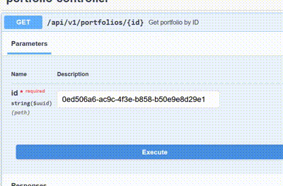

# Multi-Portfolio Investment Manager API API
## Description
A Investment Portfolio Manager API powered by Spring Boot. This project serves as a backend system to manage multiple investment portfolios containing stocks and ETFs.

## Table of Contents

1. [Key Features](#key-features)
2. [Documentation](#documentation)
3. [Technology Used](#technology-used)
4. [Prerequisites](#prerequisites)
5. [Installation](#installation)
6. [Running the Application](#running-the-application)
7. [Testsing](#testing)

## Key Features:
- **Portfolio and Investment Management API Operations**: Users perform actions for both portfolios and investments. Operations for portfolios include creating, reading, updating, deleting and sorting portfolios. Users can also move investments between portfolios. For Investments, users can perform create, read, update, delete and sort operations. Investment operations also include filtering (by name, symbol, totalValue, purchasePrice, currentPrice).
- **Automatic calculations**: The total value of investments are automatically calculated on insertion into the portfolio. Additionally, the total value of the portfolio is calculated from the total of the investments, regardless of whether investments are added or deleted, the total value will always be up-to-date.

## Documentation
The API documentation has been generated using SpringDoc and Swagger and can be accessed at http://localhost:8080/swagger-ui/index.html once the application is running. To access this documentation, the application must be running on port 8080.
The Swagger API documentation shows the available endpoints (and their usage), request parameters, response formats, and error codes.

## Project Structure
- `controllers` : Contains classes responsible for handling incoming HTTP requests, interacting with services, processing data, and forming appropriate HTTP responses. 
- `services` : holds classes that encapsulate business logic or application-specific functionality. They perform operations requested by controllers, interact with repositories for data access, perform computations, and implement the core logic of the application.
- `repositories` :  Contains classes responsible for data access. They interact with the underlying data storage (JSON file). CRUD (Create, Read, Update, Delete) operations are performed here and an abstraction layer is provided for data access.
- `model` : Contains classes that represent the data entities. These classes define the structure of the data used within the application.
- `utility` : Contains functions for handling JSON data (reading and writing).
- `exceptions` : Used to hold custom exception classes or exception-related functionalities

## Technology Used
- Java and Spring Boot: Used to create the application
- RESTful API: To handle the CRUD operations on the portfolios and investments
- JSON: Used to store portfolio data
- HashMap: JSON data was retrieved into a HashMap in order to perform CRUD and other operations.
- JUnit and Mockito: Used to test the API
- Maven: Used to manage the dependencies of the application

## Prerequisites
- JDK 17 or higher must be installed.
- Apache Maven 3.6 or newer.

## Dependencies
- Spring Boot: Used to develop a java-based, standalone, Spring-based application
- GSON: Used for JSON serialization and deserialization.
- SpringFox Swagger UI: Used to generate interactive API documentation, allowing API calls to be used directly in the browser.
- 
## Installation
1. Clone the repository
```bash
git clone git@github.com:cbfacademy/java-rest-api-assessment-kirstyabhus.git
```
2. Navigate to the projects directory
```bash
cd java-rest-api-assessment
```
3. Build the project with maven
```bash
mvn clean install
```

## Running the Application
After installing, you can run the application using the following Maven command.

  ```bash
  mvn spring-boot:run
  ```

Upon running this command, the application can be accessed with the API endpoints defined in the Swagger documentation.
<p align="center">
  
</p>

## Testing
The following test script can be used to test the application:
```bash
mvn test
```
